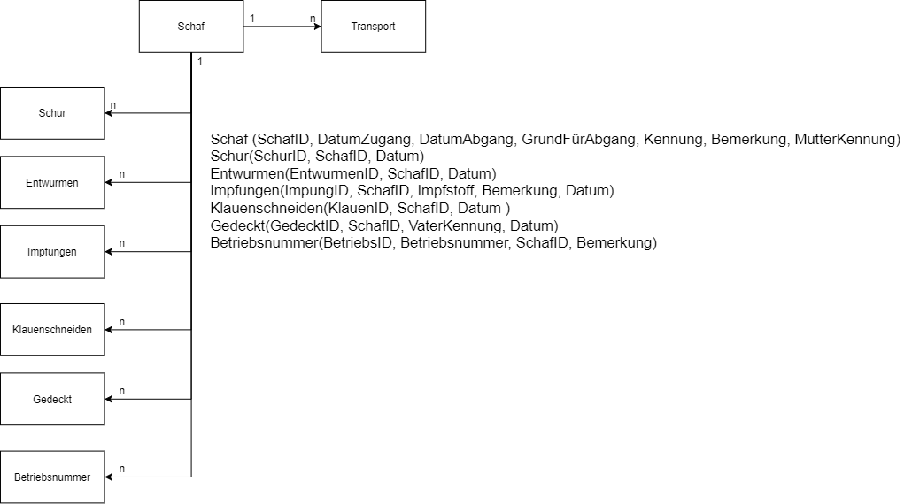
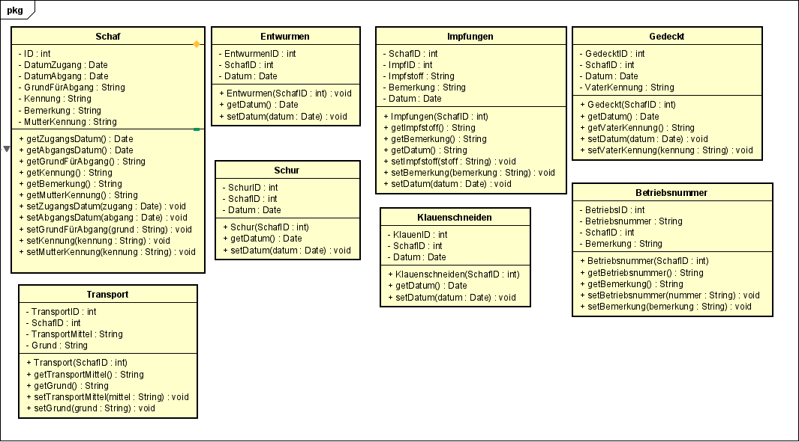

# Bestandsregister
Bestandsregister für Schäfer lol

### Roadmap (v1)

**Standart Anforderungen (Klasse Schafe):**
+ Laufende Nummer (1:1)
+ Datum des Zugangs/Abgangs (Geburtsdatum/Todestag mit Grund) (1:1)
+ Betriebsnummer/Name/Anschrift vorheriger Besitzer (1:1)
+ Betriebsnummer/Name/Anschrift des Übernehmers (1:1)
+ Kennzeichen des Transportmittels Zugmaschine/Anhänger (1:n)
+ Kennzeichen des Tieres (1:1)
+ Bemerkungen (1:1)
+ Mutterschaf (Ohrmarken Nummer) (1:1)

**Pflege:**
+ Datum letzte Schur (1:n)
+ Datum letztes Entwurmen (1:n)
+ Impfungen (1:n)
+ Datum letztes Klauenschneiden (1:n)
+ Wie oft und von wem gedeckt (1:n)

**Bestand**
+ Herkunft vom Schaf (gekauft -> von wem/geboren eigener Betrieb) (1:n)
+ Speicherung Kauf und Verkauf Kontakte (1:n)

### Roadmap (v2)
**Ausgaben und einnahmen:**
+ Kauf und Verkauf von Schafen
[Neu anlegbare Kategorien z.B.]
+ Futter
+ Zubehör
+ Fahrezeuge
+ Zäune
+ Gesamt Bestandsliste
+ Monatliche Bilanz
+ Gesamt Bilanz

### ERM Datenbank Übersicht

### Klassendiagramm

