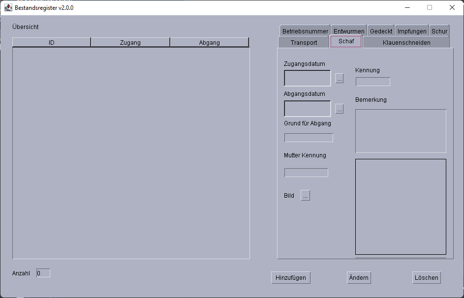

# Benutzerhandbuch Bestandsregister
Das Bestandsregister Programm wurde Entwickelt um die stetig wachsenden Anforderungen an Schäfer durch das Veterinäramt zu vereinfachen.

Indem es eine zentrale Anlaufstelle bildet für die wichtigsten Daten, die in einem Bestand erfasst und archiviert werden müssen.

## Funktionen
+ Erfassen von einzelnen Schafen
    + Zugangsdatum
    + Abgangsdatum
    + Grund für den Abgang
    + Mutter Kennung
    + Eigene Kennung
+ Erfassen und Dokumentierung der Pflege
    + Klauenschneiden
    + Impfungen
    + Schur
    + Entwurmen
+ Erfassung der Betriebsnummern bei erhalt oder verkauf
+ Erfassung der Transportmittel
+ Erfassung wie oft das Schaf gedeckt wurde

## Programmaufbau
Das Programm besitzt eine datenorientierte Benutzeroberfläche, dies bedeutet das die Steuerung durch anklicken der einzelnen Datenelemente erfolgt.

## Unterfunktionen
Alle Unterfunktionen in den Tabs sind ähnlich Aufgebaut.

Der Hinzufügen Button ist immer nur im aktuell aktiven Tab gültig, das bedeutet das im hier gezeigen Beispiel durch das Hinzufügen weitere Einträge in der Liste Entwurmen landen.

Zu Beachten hierbei ist das die Aktions Buttons (Ändern und Löschen) durch das Auswählen eines der im Beispiel gezeigten Einträge auf diese umgeleitet werden!